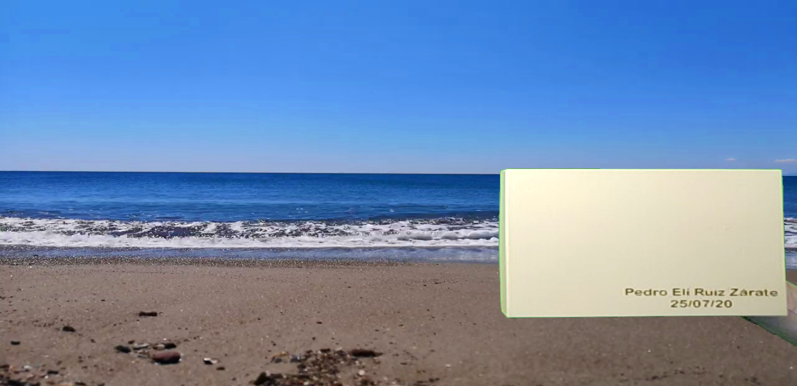

# **Social Distancing Analyzer**

Today one of the most important applications of image processing is the streaming or transmission of live multimedia content. For this reason, this project was developed in Python, which captures images taken with the computer's webcam and eliminates the background, which in this case is a green cloth.

The algorithm makes a mask that removes the background and leaves only the objects or the foreground that must be a different color from the background. the mask is shown below:

Finally, with the calculated mask, the background is replaced by another selected image, which in our case is a screenshot of the Mario Bros game:

It can be seen that the only thing that remained of the image captured with the camera was the object of a different color that is a wooden chair.

# **This project is being developed by:**

✈️ Alejandra Avendaño Cortina, [GitHub](https://github.com/alejandraavendano), Email: a_avendano@javeriana.edu.co

🏍️ Leidy Carolina Pulido Feo, [GitHub](https://github.com/Carolina-Pulido), Email: leidy_pulido@javeriana.edu.co

🏎️ Pedro Elí Ruiz Zárate, [GitHub](https://github.com/PedroRuizCode), Email: pedro.ruiz@javeriana.edu.co
