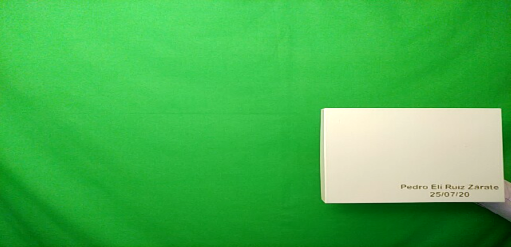

# **Green screen, Background editor**

Today one of the most important applications of image processing is the streaming or transmission of live multimedia content. For this reason, this project was developed in Python, which captures images taken with the computer's webcam and eliminates the background, which in this case is a green cloth.

### Background removal

The algorithm creates a mask that removes the background and leaves only the objects or the foreground that must be a different color from the background. For this, a photo is taken where only the green background should be shown to calculate the maximum and minimum values of each component of the HSV color space. Then, each of the video pixels that are within the maximum and minimum ranges that were calculated with the first photo are eliminated. Next, the first mask is shown, where only the foreground is kept.

Finally, with the mask calculated, the background is replaced by another selected image, which in our case can be chosen from a set of multimedia files, which can be images or videos.

### Interaction with the user

To facilitate the use of the tool, a graphical user interface was designed. When starting the execution of the algorithm, the following window is displayed:

By clicking on the button in the window, you can select whether you want to replace the background with an image or a video. If the selected option was an image, you will see the following window:

Or if the selected option was video, the following window will be displayed:

To select any of the funds that you want to show, you just have to click on it and then click close.

After this, comes the capture of the photo of the background without any foreground object. For this, after closing the window shown above, the following window will be displayed:

To take the photo, click on the camera icon. After this select close.

*After this, you can see the video generated by the algorithm on your screen!*

# **This project is being developed by:**

✈️ Alejandra Avendaño Cortina, [GitHub](https://github.com/alejandraavendano), Email: a_avendano@javeriana.edu.co

🏍️ Leidy Carolina Pulido Feo, [GitHub](https://github.com/Carolina-Pulido), Email: leidy_pulido@javeriana.edu.co

🏎️ Pedro Elí Ruiz Zárate, [GitHub](https://github.com/PedroRuizCode), Email: pedro.ruiz@javeriana.edu.co
